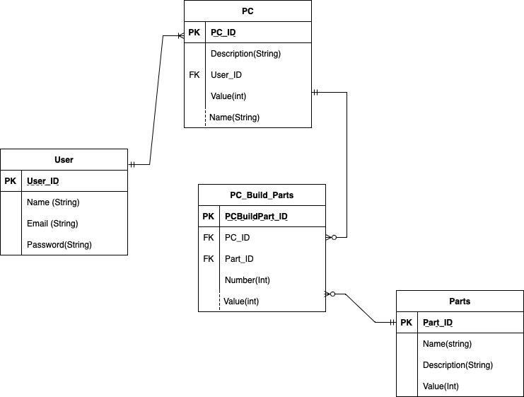

# PROJECT DOCUMENTATION

**R1 Identification of the problem you are trying to solve by building this particular app.**
The modern PC is made up of many customisable parts. Building a PC requires planning. Often a person will need to compile a list of parts on a spreadsheet or paper then used that to research configuration compatibilities and find quotes. By creating an API application we can make this process easier by storing PC configurations and the list of part.

**R2 Why is it a problem that needs solving?**

Their are number of reasons for doing this. But ultimately we trying to ease the burden on the consumer when shopping for PC parts. although the initial app MVP is just to store configurations as a catalogue of the users PC builds, it could certainly be built to allow :

1. part comparability checks, helping to resolve conflicting hardware issues often encountered after a purchase.
2. Connection to third party apis to provide multiple options and instantaneous pricing for parts.

These two are items whilst not include in todays app are surely for food for thought in creating a seed for a PC building online business model driven by having PC config first rather then scouring the web for the parts one needs.

**R3 Why have you chosen this database system. What are the drawbacks compared to others?**
PostSQL was chooses for three reasons.

1. Constraints on the options available to choose from.
2. It’s an industry standard production level database that is often used to support web applications and is therefore considered a reliable and robust choice.
3. It is low maintenance, easily adminstratored and easy to use.

Their a range of other benefits such as its wide OS compatibility support for all major programming language. It supports SQL and advanced SQL functions as well as non relational JSON. However their are draw backs:

1. Costs associated with migration, support and maintenance. Whilst downloading the software is free. Hiring a consulting practise that specialises in PostgreSQL can be a costly endeavour. Early planning is needed to anticipate such costs.
2. No single vendor control. Moving to PostgreSQL means dealing with multiple vendors. This can get confusing for example their are 5 different backup solutions on the market for PostgreSQL. Approaching multiple vendors for solutions is challenging and again consulting costs might be incurred as external expertise is sought.
3. PostgreSQL has less support across the open source field then MySQL. 4. Important in this day and age is decide weather to have PostgreSQL on premise or in the cloud. The cloud versions of PostgreSQL are most renown in Amazon cloud services. User have found that it can be quiet costly as its resource consumption is quite high. Sometimes users have
   moved back to on-premise solution to control expenses.
4. Finally companies need to work if they have the in-house expertise or if they need it. If not then they are reliant on third party partners or consultants to support the in-house skills. Sometimes a companies
   will hire new expertise in just for helping support PostgreSQL.

**R4 Identify and discuss the key functionalities and benefits of an ORM.**
Object Relational Mapping controls the interact between an application and the database it connects to. By using ORM we do not need to use direct SQL statement to work with data in the database. Instead we can use the programming language the application is being developed in. We can use things like Object Oriented Classes and models as integrated data structures instead of SQL tables. The major benefits of this are :

- Elimantes the need for repetive SQL code. Cleaner and less code. This ultimately speeds up development time.
- Less requirements to understand what going on 'under the hood' are wide variety of tasks are already implemented out of the box.
- Avoid the need for vendor specifc SQL. The ORM already knows which vendor and implements whats nessary so you dont have to worry.
- ORMs also provide some shielding agaisnt things like SQL injections making the code base more secure.
- Because the ORM abstracts the database it is easy to change database systems should one desire.

**R5 Document all endpoints for your API.**

**R6 An ERD for your app.**

**R7 Detail any third party services that your app will use.**

**R8 Describe your projects models in terms of the relationships they have with each other.**

**R9 Discuss the database relations to be implemented in your application.**

**R10 Describe the way tasks are allocated and tracked in your project.**
